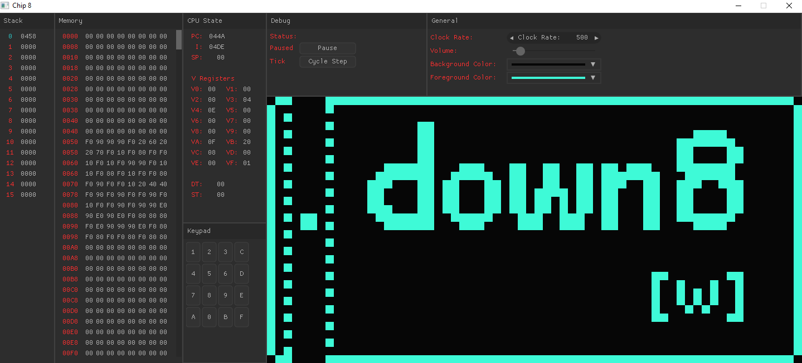

# Chip-8 virtual machine

Here is my chip-8 interpreter written with c for fun using [SDL2](https://wiki.libsdl.org/SDL2/FrontPage) 
for handling anything graphics, audio, and user input related. 
The gui was made using [Nuklear](https://github.com/Immediate-Mode-UI/Nuklear) 
which is a immediate mode gui library for c.

### Demo

